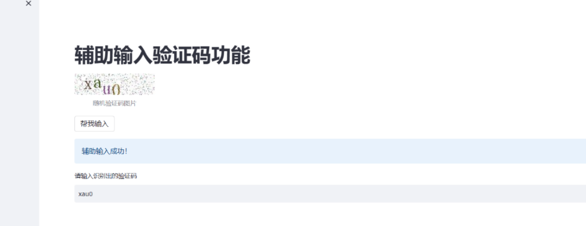

# 基于CRNN的验证码字符识别

## 项目介绍

使用CRNN进行验证码的特征提取，基于streamlit实现应用




使用环境：

 - PaddlePaddle 2.0.1

 - Python 3

   

## 准备数据集

 - 用的是这个字体[点击下载](https://down7.pc6.com/qd3/simsun.zip) 。
```shell script
python create_image.py
```

执行上面程序生成的图片会放在`dataset/images`目录下，生成的训练数据列表和测试数据列表分别放在`dataset/train_list.txt`和`dataset/test_list.txt`，最后还有个数据词汇表`dataset/vocabulary.txt`。

数据列表的格式如下，左边是图片的路径，右边是文字标签。
```shell script
dataset/images/1617420021182_c1dw.jpg	c1dw
dataset/images/1617420021204_uvht.jpg	uvht
dataset/images/1617420021227_hb30.jpg	hb30
dataset/images/1617420021266_4nkx.jpg	4nkx
dataset/images/1617420021296_80nv.jpg	80nv
```

以下是数据集词汇表的格式，一行一个字符，第一行是空格，不代表任何字符。
```shell script
 
f
s
2
7
3
n
d
w
```

## 快速开始

打开anaconda终端

```
conda create -n CRNN python==3.7
```

创建好环境后

```
conda activate CRNN
```

cd切换到该项目文件夹下

安装pillow

```
pip install pillow==8.1.2 -i https://pypi.douban.com/simple
```

运行`create_image.py`，大约需要运行一分钟

```
python create_image.py
```

安装paddle等其他库

```
python -m pip install paddlepaddle==2.1.0 opencv-python==4.5.1.48 visualdl==2.5 tqdm==4.59.0 protobuf==3.20.2 urllib3==1.26.15 Levenshtein -i https://mirror.baidu.com/pypi/simple
```

安装完成后打开另外一个conda终端用来运行visualDL

输入

```
visualdl --logdir=log --host=0.0.0.0
```

然后再浏览器上访问`http://localhost:8040`

在原终端运行训练文件

```
python train.py
```

**训练自定义数据，参考上面的格式即可。**

 - 然后再浏览器上访问`http://localhost:8040`可以查看结果显示。


页面运行：

```
streamlit run app.py
```


